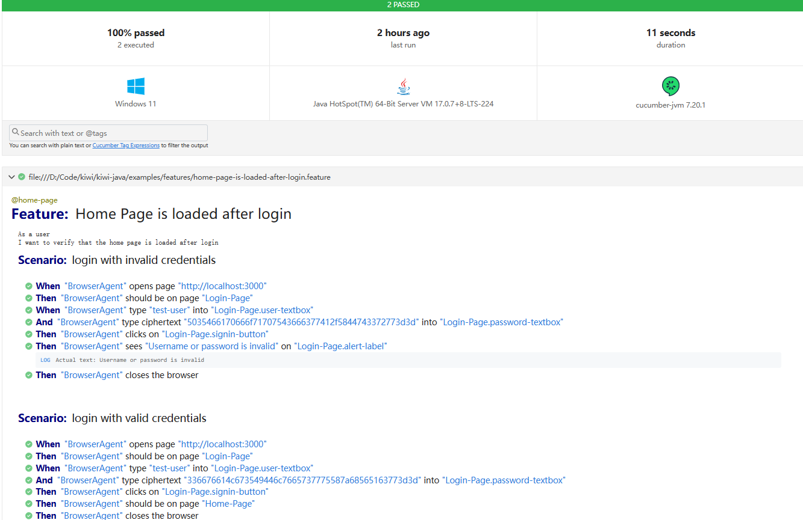

# kiwi-java
Modular BDD test automation framework in java for End-to-End functional testing, easy to extend and maintain.

# Features
- Modular design for easy maintenance and scalability
- Supports API testing with RestAssured
- Supports GUI testing with Playwright and Selenium
- Cucumber integration for BDD-style test scenarios
- Switch between different agents (API, GUI) seamlessly
- Comprehensive reporting with Allure
- Easy configuration and setup

# Examples
### Configuration
- Configure agents in 'config/{env}/agents.yml' like below:
```yaml
- !io.kiwi.config.api.RestAgentConfig
    name: RestAgent
    requestAuth:
      !io.kiwi.security.auth.BearerToken
        token: your_token_here # Replace with your encrypted actual token
    baseUrl: http://localhost:8000 # Base URL for the API, default: http://localhost:8080

- !io.kiwi.config.gui.PlaywrightAgentConfig
    name: BrowserAgent_PW
    headless: false # Whether to run the browser in headless mode, default: true
    browserType: chromium # Type of browser to use (chromium, firefox, webkit), default: chromium
    browserTimeout: 3000 # Timeout for browser operations in milliseconds, default: 30000
    elementRepo: data/web-gui-repo/web-pages.yml # Path to the element repository file

- !io.kiwi.config.gui.SeleniumAgentConfig
    name: BrowserAgent
    headless: false # Whether to run the browser in headless mode, default: true
    webDriver: chrome # Type of browser to use (chrome, firefox, edge), default: chrome
    browserTimeout: 3000 # Timeout for browser operations in milliseconds, default: 30000
    elementRepo: data/web-gui-repo/web-pages.yml # Path to the element repository file

```
### Reporting
- Cucumber reports are generated in 'target/cucumber-reports.html' directory by default.

